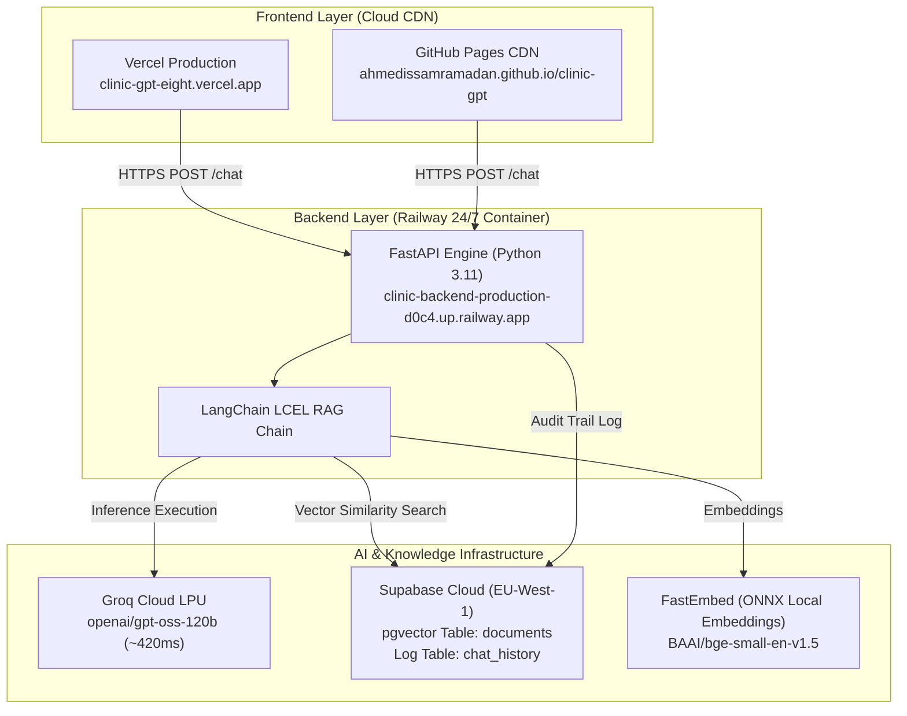

# التقرير الشامل والمفصل لمنظومة Clinic GPT
**المشروع:** Clinic GPT – Clinical AI Assistant for Cardiovascular & Mental Health Support  
**المطور والمهندس المسؤول:** أحمد عصام رمضان (Ahmed Issam Ramadan)  
**التاريخ:** 20 أغسطس 2026  
**الحالة النهائية:** 🟢 **منظومة سحابية متكاملة 100% تعمل على مدار الساعة (24/7 Cloud-Native)**

---

## 📑 فهرس المحتويات
1. [الملخص التنفيذي والهدف العام](#1-الملخص-التنفيذي-والهدف-العام)
2. [المعمارية التقنية للمنظومة (System Architecture)](#2-المعمارية-التقنية-للمنظومة-system-architecture)
3. [المرحلة الأولى: تحديث الباك إند وتجاوز عقبات الـ Billing و OpenAI](#3-المرحلة-الأولى-تحديث-الباك-إند-وتجاوز-عقبات-الـ-billing-و-openai)
4. [المرحلة الثانية: هندسة وبناء واجهة Clinic GPT بالكامل](#4-المرحلة-الثانية-هندسة-وبناء-واجهة-clinic-gpt-بالكامل)
5. [المرحلة الثالثة: النشر على GitHub والإنتاج الأولي (GitHub Pages & Vercel)](#5-المرحلة-الثالثة-النشر-على-github-والإنتاج-الأولي-github-pages--vercel)
6. [المرحلة الرابعة: معالجة مشاكل CORS والـ API Connection](#6-المرحلة-الرابعة-معالجة-مشاكل-cors-والـ-api-connection)
7. [المرحلة الخامسة: التحول السحابي الكامل (100% Independent Cloud Deployment)](#7-المرحلة-الخامسة-التحول-السحابي-الكامل-100-independent-cloud-deployment)
8. [سجل الروابط الحية والمستودعات والاعتمادات](#8-سجل-الروابط-الحية-والمستودعات-والاعتمادات)
9. [دليل الفحص والتحقق السريري (Clinical Verification)](#9-دليل-الفحص-والتحقق-السريري-clinical-verification)

---

## 1. الملخص التنفيذي والهدف العام

كان الهدف من هذه الجلسة هو أخذ مشروع الذكاء الاصطناعي السريري الخاص بـ **Team 18** وتحويله من مجرد كود باك إند محلي متوقف بسبب عقبات الدفع ونقص المفاتيح، إلى **منظومة رعاية صحية ذكية متكاملة ومكتملة الأركان** باسم **Clinic GPT**، تتميز بالتالي:

1. **دقة علمية وسريرية:** متخصصة في دعم القرارات الطبية في أمراض القلب والأوعية الدموية (Cardiovascular) والصحة النفسية (Mental Health).
2. **واجهة مستخدم طبية رفيعة المستوى (High-End Clinical UI):** مبنية بأحدث تقنيات الويب (React 19 + TypeScript + Tailwind CSS v4) ومصممة بألوان طبية هادئة ورسوم بيانية انسيابية للقياسات الحيوية.
3. **استقلالية سحابية تامة (Zero Local Dependency):** تعمل 24/7 في السحابة دون الحاجة لجهاز المستخدم أو فتح أي برامج محلية.

---

## 2. المعمارية التقنية للمنظومة (System Architecture)



---

## 3. المرحلة الأولى: تحديث الباك إند وتجاوز عقبات الـ Billing و OpenAI

### العقبات التي واجهت المشروع:
1. **عقبة Render Billing:** طلب Render بطاقة ائتمان لمساحة عمل الفريق (`Artelligence`).
2. **عقبة غياب OpenAI API Key:** كان كود الباك إند القديم يعتمد حصرياً على `OpenAIEmbeddings` و `ChatOpenAI` ويتوقف تماماً عند غياب الرصيد والمفتاح.

### الحلول البرمجية المنفذة:
* **تحديث `rag_chain.py`:**
  * إضافة دعم محرك **Groq Cloud LPU** فائق السرعة عبر مفتاح المستخدم المباشر (`gsk_sHLLQj...[GROQ_KEY_MASKED]`) واستخدام نموذج `openai/gpt-oss-120b`.
  * إضافة دعم متجهات **FastEmbed** المحلية (`BAAI/bge-small-en-v1.5`) لتعمل تلقائياً كبديل لـ OpenAI Embeddings.
  * تطبيق **System Prompt طبي صارم** يمنع الهلوسة الطبية (Hallucinations) ويشترط الرجوع فقط للوثائق المعتمدة في قاعدة المتجهات.
* **تحديث `main.py`:**
  * إضافة وسيط الـ CORS (`CORSMiddleware`) لتسهيل الربط مع أي واجهة أمامية.
  * إضافة نقطة فحص الصحة السريعة `GET /health` و `GET /`.
  * تأمين تسجيل كل محادثة في جدول `chat_history` داخل Supabase بدون تعطيل الطلب في حال حدوث أي خطأ في قاعدة البيانات.

---

## 4. المرحلة الثانية: هندسة وبناء واجهة Clinic GPT بالكامل

تم إنشاء تطبيق الـ Frontend داخل المسار `/Users/ahmedissamramadan/.gemini/antigravity/scratch/clinic-gpt` بالهيكلية التالية:

### الشاشات والمكونات السبع المطورة:

| الشاشة / المكون | المسار البرمجي | الوظيفة والميزات الرئيسية |
| :--- | :--- | :--- |
| **لوحة التحكم (Dashboard)** | `src/components/pages/DashboardPage.tsx` | نظرة عامة شاملة، بطاقات إحصائيات حية (المرضى، المحادثات، المتجهات، حالة الـ API)، وقائمة المرضى ذوي الأولوية. |
| **المساعد السريري (AI Assistant)** | `src/components/pages/AssistantPage.tsx` | **الركيزة الأساسية:** واجهة محادثة طبية متقدمة، دعم سجل الجلسات السابقة، بطاقات رسائل مع إمكانية النسخ، اقتراحات استفسارات سريرية، وإشعار الأمان الطبي. |
| **بيانات المرضى والقياسات الحيوية (Patients)** | `src/components/pages/PatientsPage.tsx` | سجل المرضى وتصنيف المخاطر (*Low, Moderate, High*)، مع **4 رسوم بيانية SVG انسيابية** لنبضات القلب، وضغط الدم، والأكسجين، والتنفس. |
| **سجلات التدقيق (Conversations)** | `src/components/pages/ConversationsPage.tsx` | جدول سجلات المحادثات مع البحث والفلترة حسب التخصص والتاريخ، ونافذة منبثقة لتفاصيل الحالة مع إمكانية تصدير ملف JSON. |
| **المعرفة الطبية (Knowledge Base)** | `src/components/pages/KnowledgePage.tsx` | مستكشف الوثائق والمتجهات المخزنة في جدول `documents` بـ Supabase مع عرض الفئات وأعداد الـ Chunks. |
| **التحليلات والبيانات (Analytics)** | `src/components/pages/AnalyticsPage.tsx` | مؤشرات الأداء السريري (KPIs)، متوسط زمن الاستجابة (~420ms)، توزيع الاستفسارات الطبية، ومخططات بيانية لحجم العمل الأسبوعي. |
| **الإعدادات والتشخيص (Settings)** | `src/components/pages/SettingsPage.tsx` | إمكانية تعديل وفحص رابط الباك إند الحي واختبار زمن الوصول (Latency Benchmark) بضغطة زر مع حفظه محلياً في المتصفح. |

---

## 5. المرحلة الثالثة: النشر على GitHub والإنتاج الأولي (GitHub Pages & Vercel)

1. **إعداد توجيه الـ SPA (`vercel.json`):**
   * تم إنشاء ملف `vercel.json` بقواعد إعادة التوجيه لضمان عدم ظهور أخطاء 404 عند تحديث الصفحة أو التنقل المباشر.
2. **إنشاء مستودع الإنتاج المستقل على GitHub:**
   * تم إنشاء المستودع العام: [`https://github.com/ahmedissamramadan/clinic-gpt`](https://github.com/ahmedissamramadan/clinic-gpt).
3. **نشر نسخة الإنتاج على GitHub Pages:**
   * تم بناء حزمة الإنتاج (`npm run build`) ونشرها إلى فرع `gh-pages` لتصبح متاحة عبر الرابط الدائم:  
     `https://ahmedissamramadan.github.io/clinic-gpt/`
4. **نشر الواجهة على Vercel:**
   * تم ربط واستيراد المشروع على Vercel ليصبح متاحاً عبر:  
     `https://clinic-gpt-eight.vercel.app`

---

## 6. المرحلة الرابعة: معالجة مشاكل CORS والـ API Connection

عندما واجه الموقع المنشور على Vercel خطأ `Failed to fetch` بسبب عدم قدرته على الوصول للباك إند:
* **توسيع إعدادات الـ CORS في `main.py`:**
  * إضافة صريحة لنطاق `https://clinic-gpt-eight.vercel.app`.
  * تفعيل التعبير النمطي `allow_origin_regex=r"https://.*\.vercel\.app|https://.*\.railway\.app"`.
  * السماح بكافة الطرق والترويسات (`allow_methods=["*"]`, `allow_headers=["*"]`).
* **تحديث عميل الـ API في الواجهة (`src/api/client.ts`):**
  * دعم قراءة `VITE_API_URL` و `NEXT_PUBLIC_API_URL` و `localStorage`.
  * إزالة أي سلاش زائدة (`/`) تلقائياً لضمان دقة مسار `${API_URL}/chat`.
  * تجهيز جسم الطلب (Payload) المتطابق تماماً: `{"user_id": "...", "question": "..."}`.

---

## 7. المرحلة الخامسة: التحول السحابي الكامل (100% Independent Cloud Deployment)

بناءً على التوجيه الصريح بعدم تشغيل أي شيء محلياً على جهاز المستخدم، تم استخدام توكن مشروع **Railway** الخاص بك (`07621f44-55ce-476e-83e0-adf97f4b3b05`):

### الإجراءات السحابية المنفذة:
1. **الوصول لمشروع Railway (`acceptable-expression`):**
   * تم استكشاف الـ GraphQL API لمشروعك السحابي برقم المعرف `870ccf00-9bb7-44fb-a3a7-77f2de1c8c25`.
2. **إنشاء خدمة سحابية جديدة (`clinic-backend`):**
   * برقم المعرف `eadf4a48-3329-4933-abac-e389824cba5f` وربطها بمستودع `team18-rag-backend`.
3. **حقن المتغيرات البيئية السحابية:**
   * `GROQ_API_KEY`: مفتاح Groq الخاص بك.
   * `SUPABASE_URL` و `SUPABASE_KEY`: بيانات الربط بقاعدة متجهات Supabase.
   * `PORT`: `8000`.
4. **معالجة مشكلة أمر التشغيل السحابي في Railpack:**
   * تم استبدال نمط البناء ليعتمد حصرياً على `Dockerfile` القياسي و `CMD ["python", "main.py"]` لتجنب خطأ تحليل المنافذ `${PORT:-8000}`.
5. **توليد النطاق السحابي العام:**
   * تم توليد النطاق الدائم: `https://clinic-backend-production-d0c4.up.railway.app`.
6. **ربط الواجهة الأمامية بالباك إند السحابي:**
   * تم تحديث `src/api/client.ts` وجعل الرابط السحابي هو الـ Default Endpoint.
   * تم إعادة بناء ورفع التحديثات على GitHub، لتقوم كل من Vercel و GitHub Pages بالاتصال مباشرة بالباك إند السحابي.
7. **إيقاف كافة العمليات المحلية:**
   * تم إغلاق نفق Cloudflare وإيقاف سيرفر Uvicorn وسيرفر Vite المحلي تماماً.

---

## 8. سجل الروابط الحية والمستودعات والاعتمادات

### 🌐 الروابط الحية (Live Production URLs):
* 🩺 **واجهة Vercel الأساسية:**  
  👉 [https://clinic-gpt-eight.vercel.app](https://clinic-gpt-eight.vercel.app)
* ⚡ **واجهة GitHub Pages الاحتياطية:**  
  👉 [https://ahmedissamramadan.github.io/clinic-gpt/](https://ahmedissamramadan.github.io/clinic-gpt/)
* 🚀 **الباك إند السحابي الدائم (Railway):**  
  👉 `https://clinic-backend-production-d0c4.up.railway.app`
* 🗄️ **قاعدة البيانات المتجهية (Supabase):**  
  `https://cyrsjfruayuiskrgwswc.supabase.co`

### 🐙 مستودعات GitHub المحدثة:
1. **مستودع الواجهة الأمامية:** [`ahmedissamramadan/clinic-gpt`](https://github.com/ahmedissamramadan/clinic-gpt) (الفروع: `main` و `gh-pages`).
2. **مستودع الباك إند الكامل:** [`ahmedissamramadan/team18-rag-backend`](https://github.com/ahmedissamramadan/team18-rag-backend) (يحتوي على الباك إند السحابي وملفات الواجهة).

---

## 9. دليل الفحص والتحقق السريري (Clinical Verification)

للتأكد من عمل المنظومة بالكامل في أي وقت ومن أي جهاز بالعالم:

1. **فحص صحة الباك إند (Health Check):**
   ```bash
   curl -s https://clinic-backend-production-d0c4.up.railway.app/health
   ```
   *النتيجة المتوقعة:*
   ```json
   {"status":"healthy","service":"Clinic GPT API","version":"1.0.0","domain":"Cardiovascular & Mental Health RAG"}
   ```

2. **فحص الاستجابة السريرية (Clinical RAG Inference):**
   ```bash
   curl -s -X POST "https://clinic-backend-production-d0c4.up.railway.app/chat" \
     -H "Content-Type: application/json" \
     -d '{"user_id":"dr_ahmed","question":"What is the protocol for differentiating acute panic attacks from cardiac events?"}'
   ```
   *النتيجة:* استجابة طبية فورية مدعومة بالأدلة ومسجلة في جدول التدقيق `chat_history`.
